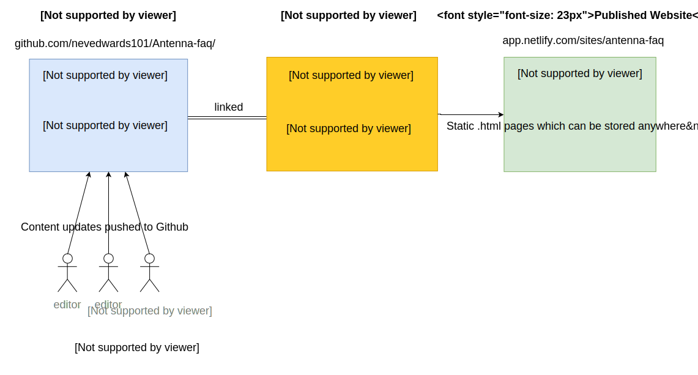

# Antenna-faq
Source files for Antenna docs and FAQs

Site auto generated with MkDocs and hosted for free on Netlify.
View the docs here:

<http://antenna-faq.netlify.com/>

Changes made to source files on the master branch will be automatically picked up by netlify and a new build generated and deployed to the url above.

# How to make changes to Antenna FAQ

- Source files: <http://github.com/nevedwards101/Antenna-faq/>
- Published website:  <http://antenna-faq.netlify.com/>

##Getting started

Before you can make changes to the docs you will need an active GitHub account (sign up for free at github.com) and also be added as a contributor on the Antenna-faq github repo. 

If you are not already added as a contributor on the Antenna-faq repo email <mailto:nedwards@antennainternational.com> with your github username so you can get added as a contributor.

Once you are setup as a contributor you'll be able to submit changes to the repo and see your updates reflected on the live site. 

## How it works

The layout, navigation, header, footer etc for each page is auto generated by a static site generator called [mkDocs](www.mkdocs.org/). Using mkDocs allows us to focus just on editing the content and let mkDocs handle the generating of navigation and layout of the website.

The source files for the content for each page of the Antenna-FAQ site are written in markdown, saved as `.md` files. 
These are stored in the `/docs` folder inside the `Antenna-faq` repo stored in github.

When changes are made to the `.md` source files and pushed to Github they will be auto-detected by [Netlify](https://www.netlify.com/) which then runs a task to re-generate the site using mkDocs and publish the updates to http://antenna-faq.netlify.com/.

See diagram below for a visual explanation of the build process.

## Making Updates

Notes on how to make edits here: <http://antenna-faq.netlify.com/editing_how_to/>

