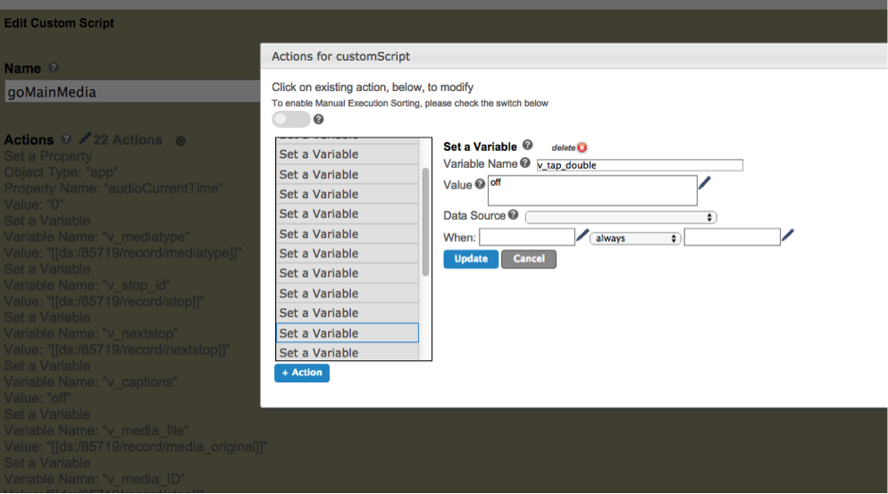

<h1>Iris 2 & iOS/Android Base App Technical Manual</h1>
<h3>Version 1.0</h3>
<h4>Netlify hosted version</h4>
---------

[https://publisher.antenna.cc/apps/20320/document](https://publisher.antenna.cc/apps/20320/document)

>##Introduction

The Base app is an internally developed tool that encapsulates all the baseline functionality that is required in many of our day to day project builds. The framework of the application has been built out using the Eachscape platform, whom we have an on-going partnership with. The Base App(s) are available as starter templates with Eachscape and the master Base App projects live within the rout folder of the Antenna International sandbox.

The Base app was built to support the following using phone based form factors:

- IRIS2
- Android Devices 4.4 and above
- iOS Devices 6.16 and above

It will also partially support with adjustments and ongoing work:

-Antenna Samsung 2.3 Android based players
-Tablet form factors

[Baseapp Guidelines and PDF's can be found at: FTP_Cloud/GUIDELINES_DOCUMENTS/Baseapps_2015ftp]()


-----

>## Default Base App Settings

See also certificates and app packaging, and genertating builds.

>**IRIS 2**

**Events**

<table>
  <tr>
    <td>Iris Charger Connected </td>
    <td>End Session and Shut Down App</td></tr>
    <tr>
    <td>Iris Key Press</td>
    <td>Run Script - goKeypad</td>
  </tr>
  <tr>
  <td>Iris Menu tap</td>
  <td>Blank</td>
  </tr>
  <tr>
  <td>Iris Search Tap</td>
  <td>Blank</td>
  </tr>


</table>

**AI Device**

<table>
<tr>
<td>Antenna International Device</td>
<td>Yes</td>
</tr>
<tr>
<td>AI Player Type</td>
<td>IRIS2</td>
</tr>
<tr>
<td>Iris Home Button View</td>
<td>00 DS Initialise</td>
</tr>
<tr>
<td>Charger Mode Remove View</td>
<td>00 DS Initialise</td>
</tr>
<tr>
<td>Home Button Long Press Enabled</td>
<td>Yes</td>
</tr>
<tr>
<td>Iris Save First Key Value</td>
<td>Yes</td>
</tr>
<tr>
<td>Iris Launch View On Play Press</td>
<td>Blank</td>
</tr>
<tr>
<td>Iris Side Scrolling Enabled</td>
<td>only if requested otherwise should be blank</td>
</tr><tr>
<td>Iris Side Button Sensitivity</td>
<td>0.3s if above is enabled</td>
</tr>
<tr>
<td>Iris Dim Screen</td>
<td>5m</td>
</tr><tr>
<td>Iris Standby Timer</td>
<td>7 minutes</td>
</tr>
<tr>
<td>Iris Standby View</td>
<td>Blank</td>
</tr>
</table>


>**iOS**

**Events**

<table>
  <tr>
    <td>Iris Charger Connected </td>
    <td>End Session and Shut Down App</td></tr>
    <tr>
    <td>Iris Key Press</td>
    <td>Blank</td>
  </tr>
  <tr>
  <td>Iris Menu tap</td>
  <td>Blank</td>
  </tr>
  <tr>
  <td>Iris Search Tap</td>
  <td>Blank</td>
  </tr>

</table>

**AI Device**

<table>
<tr>
<td>Antenna International Device</td>
<td>No</td>
</tr>
<tr>
<td>AI Player Type</td>
<td>Blank</td>
</tr>
<tr>
<td>Iris Home Button View</td>
<td>00 DS Initialise</td>
</tr>
<tr>
<td>Charger Mode Remove View</td>
<td>00 DS Initialise</td>
</tr>
<tr>
<td>Home Button Long Press Enabled</td>
<td>00 DS Initialise.</td>
</tr>
<tr>
<td>Iris Save First Key Value</td>
<td>No</td>
</tr>
<tr>
<td>Iris Launch View On Play Press</td>
<td>Blank</td>
</tr>
<tr>
<td>Iris Side Scrolling Enabled</td>
<td>Blank</td>
</tr><tr>
<td>Iris Side Button Sensitivity</td>
<td>Blank</td>
</tr>
<tr>
<td>Iris Dim Screen</td>
<td>52m</td>
</tr><tr>
<td>Iris Standby Timer</td>
<td>never</td>
</tr>
<tr>
<td>Iris Standby View</td>
<td>Blank</td>
</tr>
</table>

>**Android**

**Events**

<table>
  <tr>
    <td>Iris Charger Connected </td>
    <td>End Session and Shut Down App</td></tr>
    <tr>
    <td>Iris Key Press</td>
    <td>Blank</td>
  </tr>
  <tr>
  <td>Iris Menu tap</td>
  <td>Blank</td>
  </tr>
  <tr>
  <td>Iris Search Tap</td>
  <td>Blank</td>
  </tr>

</table>

**AI Device**

<table>
<tr>
<td>Antenna International Device</td>
<td>No</td>
</tr>
<tr>
<td>AI Player Type</td>
<td>Blank</td>
</tr>
<tr>
<td>Iris Home Button View</td>
<td>00 DS Initialise</td>
</tr>
<tr>
<td>Charger Mode Remove View</td>
<td>00 DS Initialise</td>
</tr>
<tr>
<td>Home Button Long Press Enabled</td>
<td>00 DS Initialise.</td>
</tr>
<tr>
<td>Iris Save First Key Value</td>
<td>No</td>
</tr>
<tr>
<td>Iris Launch View On Play Press</td>
<td>Blank</td>
</tr>
<tr>
<td>Iris Side Scrolling Enabled</td>
<td>Blank</td>
</tr><tr>
<td>Iris Side Button Sensitivity</td>
<td>Blank</td>
</tr>
<tr>
<td>Iris Dim Screen</td>
<td>52m</td>
</tr><tr>
<td>Iris Standby Timer</td>
<td>never</td>
</tr>
<tr>
<td>Iris Standby View</td>
<td>Blank</td>
</tr>
</table>

>**Samsung 2.3**

**Events**

<table>
  <tr>
    <td>Iris Charger Connected </td>
    <td>End Session and Shut Down App</td></tr>
    <tr>
    <td>Iris Key Press</td>
    <td>Blank</td>
  </tr>
  <tr>
  <td>Iris Menu tap</td>
  <td>Blank</td>
  </tr>
  <tr>
  <td>Iris Search Tap</td>
  <td>Blank</td>
  </tr>

</table>

**AI Device**

<table>
<tr>
<td>Antenna International Device</td>
<td>Yes</td>
</tr>
<tr>
<td>AI Player Type</td>
<td>Samsung Player</td>
</tr>
<tr>
<td>Iris Home Button View</td>
<td>00 Home redirect (contains a view with a html block that fires a script sending the app back to the 00 DS initialize screen with timer started)</td>
</tr>
<tr>
<td>Charger Mode Remove View</td>
<td>00 DS Initialise</td>
</tr>
<tr>
<td>Home Button Long Press Enabled</td>
<td>00 Home redirect (contains a view with a html block that fires a script sending the app back to the 00 DS initialize screen with timer started).</td>
</tr>
<tr>
<td>Iris Save First Key Value</td>
<td>No</td>
</tr>
<tr>
<td>Iris Launch View On Play Press</td>
<td>Blank</td>
</tr>
<tr>
<td>Iris Side Scrolling Enabled</td>
<td>Blank</td>
</tr><tr>
<td>Iris Side Button Sensitivity</td>
<td>Blank</td>
</tr>
<tr>
<td>Iris Dim Screen</td>
<td>52m</td>
</tr><tr>
<td>Iris Standby Timer</td>
<td>never</td>
</tr>
<tr>
<td>Iris Standby View</td>
<td>Blank</td>
</tr>
</table>

**NB In EMEA Tech will overide the settings on the Samsung player during upload for screen timeouts**


-----

>## Certificates and app packaging

The Base App is setup to use the standard Antenna Enterpise certifcate by default.

However for iOS Onsite builds clients will have to provide their own Enterprise certificate for teh final commercial build that is to be used onsite.
Further guidelines [here]()

For Android builds the Base App is setup to use the standard Antenna certificate and the Android package name is set to com.antenna.app as default.

This can be left as is for onsite commercical builds on Android.

For downloables to clienets store fronts these should be updated to the clients details and appropiate package name.


-----


>## Generating Builds

**ONSITE**

>**IRIS2**

- Use Android 4.4 and higher

>**iOS**

- Use iOS 9, 8 and 7 Scaled - ONLY FOR iPhone5 APPS - when you are doing an on-site build for iPod4/5/6 that is not built for multiple screens. This will force the displayport to 320 and scale that on any larger screen iPhone 6s. This means your app will still look decent on the 6, it's just not optimized for it

- Use iOS 9, 8 and 7 Pixel Perfect - when using iPhone 6 assets -Bare in mind this will use the full range of viewport sizes for the devices -ie: scaling down. (iPhone 5 = 320, iPhone 6 = 375, iPhone 6+ = 414)

- Use iOS 5 and 6 - when the onsite devices are on 6.16 firmware

- Make sure to tick the checkbox option for Track Data Source Pagination on any patterns that need to keep track of postition.

>**Android 4.4>**

- Use Android 4.4 and higher

- Make sure to untick the checkbox option for Track Data Source Pagination on any patterns that need to keep track of postition or you may get repeating patterns.

>**Android 2.3 (Samsungs)**

- Use Android 2.3 for Antenna with Video Back Fix

-----

**Downloadables**

>iOS

- Use iOS 9, 8 and 7 Scaled - ONLY FOR iPhone5 APPS - when you are doing an on-site build for iPod4/5/6 that is not built for multiple screens. This will force the displayport to 320 and scale that on any larger screen iPhone 6s. This means your app will still look decent on the 6, it's just not optimized for it

- Use iOS 9, 8 and 7 Pixel Perfect - when using iPhone 6 assets -Bare in mind this will use the full range of viewport sizes for the devices -ie: scaling down. (iPhone 5 = 320, iPhone 6 = 375, iPhone 6+ = 414)
- iOS Tab - under other settings select the development region to match your apps region
- General Tab - Advanced tab audio plays in background

>Android

- Use Android 4.4 and higher
- General Tab -If the app is over 50mb it will need to use content distribution
- General Tab - Advanced tab audio plays in background
- Set the v_downloadable varible in the launch events to true - if you wnat to enable Android Device Back button options. You;re are likely to need to adjust events based on your particular apps navigational flow. This can be done on the edit tab for ecah view and then editing the Android back events. Currently when set to true the Android Back button on the main menu will exit the app - on Audio/video views it will caus ethose to return to previous views and run associated scripts.
- NB the Androdi Back Button Event captures any "swithc to previous" event an dthen runs those actions - this can be used to disable the Android on device back button with caution.

-----


>## Assets, Themes and Fonts


**Changing the Theme**

The Base app’s default theme setting is dark. To switch to light or custom, copy the Base app into a new workspace, delete the unneeded theme records from base_themes and base_keypad and change the colour of the fonts in the Themes section. Going from Dark to Light, where the font was #ffffff change to #595959 and the secondary coloured font from #595959 to #ffffff. Individual background colours on the top level canvas of each view. Default background colour is set via the theme’s collection in the blackorwhite column. Text displayed in HTML blocks is pulled from the HTMLTextColour column, dark setting is #fffff light is #595959

If your app has a survey the font colours are set in base_survey_config. 

**Fonts**

The standard font theme is Open Sans. This is all run through the "theme" section of the base app which is limited to having 5 fonts running through the whole app. Other fonts can be added and used, but you must make sure these are either cleared for use by our internal licensing department or the client owns the font and is solely responsible for the use of it in the app.

You must load and reference separate font weights as different files into the app.You will need to modify the font file for the additional weights beyond normal. Shaun F has been doing the modifications to the font files. Once loaded into the Publisher, take OpenSans for example, this will show the font name as Open Sans Bold and you should select the weight as bold also. Html using the fonts must be referenced with the font-family CSS you can see View 14 InfoView for example code.

  ```
    @font-face {
    font-family: OpenSans;
    font-weight: normal;
    font-style: normal;
    src: url('fonts/OpenSans-Regular.ttf');
}```

-----


**Assets**

Assets for the Base app should be provided according to the specifictions outlined here:

[Smarthseet Asset Sheet](https://app.smartsheet.com/b/home?lx=l6wb_Bu1VgEdeH8pmgRJyA)

***Smarthseet needs a pass to check***

[Useful Asset size calculator](tinyurl.com/nevcalc)

-----


>## Cloud Collection / Batch upload

The base app currently runs from individually uploaded cloud collection assets.

[Google Doc templates](https://drive.google.com/folderview?id=0B-4IrW_F-LIRU0h2OFRTWndZTVE&usp=sharing) are available here for both IRIS2 and iOS/Android Base Apps.

These can be used for batch uploads to the Cloud Collections.

The current cloud sources are as follows:

<table>
<tr>
<td>base_themes</td>
<td>Contains all styling records and media controls</td>
<tr>
<td>base_languages</td>
<td>The languages to be used in the app and the associated app text</td>
<tr>
<td>base_tour_selection</td>
<td>Sets up the tourtypes and icons in the app</td>
</tr>
<tr>
<td>base_mainmenu</td>
<td>Contains the main media audio/video thumbs for the main menu view and keypad laucnhed content</td>
</tr>
<td>base_submenu</td>
<td>Contains the main media audio/video thumbs for the sub menu view</td>
</tr>
<tr>
<td>base_slides</td>
<td>Contains images for slideshows and galleries</td>
</tr>
<tr>
<td>base_welcome</td>
<td>Contains the Welcome stop media if empty the app will automatically bypass this view</td>
</tr>
<td>base_keypad</td>
<td>Contains the visual assets for the keypad</td>
</tr>
<tr>
<td>base_info_collection</td>
<td>Contains data for the seperate inofrmation views within the app</td>
</tr>
<tr>
<td>base_captions</td>
<td>Contains subtitl information for video views</td>
</tr>
<tr>
<td>IN BETA base_voiceover_labels</td>
<td>Contains information for ADA compliance</td>
</tr>
</table>

**Powerblocks have their corresping data sheets as additional tabs on the templates.**


[Eachscape Support Cloud documenation](http://support.eachscape.com/customer/portal/articles/search?q=cloud+collection)


------


>## Reset codes and procedure

Any changes to the standard resets must be made know to Tech and Account Managment for operational purposes.

**IRIS 2**

Due to insecurities with the current IRIS2 reset procedure, and after trialing this new procedure at HRP Scotland - the following new procedure has been added to the IRIS2 base app.

The reset is activated from the keypad by typing 9317 and then hitting Iris2 play button.

This will navigate the user to the 01 Client Services Battery Screen.

Once here the user needs to type in 8432 and then hit the IRIS2 play button to exit the app to the settings page.

If this is entered incorrectly the app will need to be restarted by hitting the next button and beginning again the 9317 reset method.

The 01 Client Services Battery Screen contains an IRIS input text block that is hidden off view where there key press 8432 will be registered.

The battery tap to Exit has been removed only at the ES script level and remains in the battery html code itself - so if you need to reinstate the tap action method you will just need to add the appropriate actions into the "battery" script by adding the launch 00 Battery Exit App Layer.


** iOS Onsite apps **


iOS onsite apps will be locked by Tech department so that they can not be exited.
9317 code from the keypad will exit the app to the 01 Client Services Battery Screen.

If the app does not have a keypad then a bespoke exit/reset process will have to be implemented.
This is often a hidden touchabel area within the app for the reset.


**Android Onsite apps **


Onsite Android apps will be locked by Tech department using App Locker.
9317 code from the keypad will exit the app to the 01 Client Services Battery Screen.
A tap on the battery icon will open the prompt to exit to settings.

If the app does not have a keypad then a bespoke exit/reset process will have to be implemented.
This is often a hidden touchabel area within the app for the reset.

**Downloadable Apps**

Should have the exit/reset commands removed and the 01 Client Services Battery Screen bypassed.
To remove the 9317 reset script - select "10 Keypad Image Play Inactive Canvas" from Published blocks > events and remove the associated 9317 actions


----


>## Data Reporting

**Overview**

Data Reporting is possible in all AI Base app builds. So see the most up to reporting offerings and documentation on proceses, please refer to the Data Reporting Documents on basecamp [https://antennaaudioltd.basecamphq.com/projects/12892673-data-reporting/log](https://antennaaudioltd.basecamphq.com/projects/12892673-data-reporting/log)

Below is an example of a standard report the client would get.

1. *Number of visitors per tour and per language*

2. *Number of visitors per stop and per language*

3. *Number of visitors by language*

4. *Number of visitors by tour*

5. *Top 10 most listened stops*

6. *Top 10 least listened stops*

7. *Number of visitors per tour over time (i.e. a timeline view)*

8. *Number of stops/commentaries that have been repeated*

9. *Detailed activity per tour, i.e. completed stops and cancelled stops*

10. *Number of devices used at any point in time*

11. *Average listening time per stop and per language*

12. *Number of operational instructions activated per language*

>**Data Reporting - In App Setup**

To turn reporting on in the app go to Edit Application. Under 3rd Party>Antenna Reporting you will need to edit/confirm the following settings:

<table>
  <tr>
    <td>Field</td>
    <td>Value</td>
    <td>Description</td>
  </tr>
  <tr>
    <td>Antenna International Reporting</td>
    <td>Yes (default is No)</td>
    <td></td>
  </tr>
  <tr>
    <td>Use analytics</td>
    <td>Yes (default is No)</td>
    <td></td>
  </tr>
  <tr>
    <td>Reporting domain</td>
    <td>Blank or extdrive depending on device and on-site setup</td>
    <td>Blank will cause the reporting data to be sent over wifi to the Eachscape servers. Entering extdrive in here will cause the reports to be stored locally on the device.  Iris 2 this should be set to extdrive. The data is then harvested from the devices via the data chargers. For Samsung you can use either, but you should confirm which one to use with Eamon, Patrick and the account manager, as it is dependent on either there being wifi on-site or Data Chargers. For iOS devices you should leave this value as blank, as it is not possible to harvest data from the devices using a rack. </td>
  </tr>
  <tr>
    <td>Max reporting log size</td>
    <td>blank</td>
    <td>Leave as blank unless told otherwise. </td>
  </tr>
  <tr>
    <td>Reporting level</td>
    <td>Limited (Standard is default)</td>
    <td>This will limit the number of events captured. </td>
  </tr>
</table>


>**Data Reporting - Block Configuration**

(as of July 16th 2015) The Base app is already configured with the below setup. But should you need to modify an existing app you can use this guide. Audio and Video blocks are pre-coded to log information such as audio duration when a stop was cancelled. All you need to do is configure the blocks to report the ID of the stop, details below.

[[var:v_media_ID]] - Use this variable to store the unique stop/sub ID for your content. Set this on launching your content. The reason we use a different variable to do this is sometimes the stop or sub variable is set to be cleared on the done action of the audio/video block and will fire before the block has had a chance to report the data for the ending of the track. Resulting in the end action being reported without the contents unique ID.

Edit Application>Events>Basic

Set a variable v_tour_type = Adult - This is to set the default tour as Adult. It will get overwritten if there’s a tour selection page, but ensure there’s a value in the variable if there’s no tour selection page.

Audio and Video Blocks>Advanced>Reporting Value

[[var:v_tour_type]]_[[var:v_media_ID]] - Setting this will ensure each media event is logged with the tour type and stop number.

**Start New Session**

This action should sit on the language confirm button. It’s required for reporting. Both versions of the Base app have this coded as of Oct 13th 2015.

Dimension 1 should be filled in with: [[var:v_language]]

**End Session**

For non-iOS builds this action can be added to Iris Charger Connected under edit app.

For both types of builds you should also add it to the Reset script, which would be triggered by entering the reset code in the keypad.

>**Data Reporting - Session Start and Session End**

In order to give us the flexibility to have Apps where the visitor can change tours we will be capturing the Start of the visitor’s Session on the Language Confirmation page. This means if needs be the visitor can be routed back to the Select Tour page without resetting their reporting session.

02a Confirm Btn Layout - Start New Session. D1=[[var:v_language]]

End Session is programmed in to Edit Application>Events>AI Device>Iris Charger Connected and also the reset code on the Keypad. The latter is the only valid option for iOS.

>**Reporting - Lookup tables**

In order to correlate the data between the app and Splunk we need to provide Patrick with a lookup table of stops in the app. This will be in the form of a Excel sheet or CSV.

The easiest way to do this is to download your Cloud Collection as a CSV file. Open this CSV in something other than Excel, such as Open office. Excel does not open CSV files with the proper text encoding and you will lose your special characters. I recommend pasting this in to an Excel doc now. You’ll need to clean up your columns and merge two of them so you have the following:


Language – This is the 3 digit language code that should match the value that’s getting reported in Session Start in the D1 key


StopNo – Here we’re going to merge the tour column with the stop number separated by an underscore. To do this in Excel or Open office create a new column. In the first cell of that column enter = then on the same row click the cell of the Tour column then type &"_”& then click the cell of the Stop number column. The formula should now look something like =B1&”_”& Hit Enter and you should see it populate with the proper value, for example Adult_100. You now need to drag the bottom right of that cell down so it expands to fill the rest of the cells below that you have content for. Highlight these newly created cells and click copy. Now with the same cells highlighted you want to paste-special and select values only. What this will do is replace the formula with the values that it created. The contents of the cells will look the same.


Title – Here it might make sense to use the AV title of your items, especially if Titleline1 has really long titles.


TourType – This should reference the tour type and is the column you should have used for the merge above.


Duration – The duration in seconds of the media file. This column exists from the Cloud Collection import. If you are using old data sheets you can get these numbers easily by dropping your audio files in to iTunes on a playlist. You can then select all your tracks and copy paste the info out.


Type – audio or video

Here’s an example of a completed lookup [table](https://docs.google.com/spreadsheets/d/11aofwZ_2lHmopdDPKnS6y-h4flEzl4w0pKhXxSwX56Q/edit?usp=sharing)
This is the baseapp [example](https://docs.google.com/spreadsheets/d/1jWOe7RtE1rjaxgbqnkpWAvN2ih_nACJonJQ7JvkxAlM/edit?usp=sharing)

>**Reporting - Splunk**

Splunk is a third party provider that takes the data from the app, via the Eachscape servers and produces reports and data visualizations. [https://da.antenna.cc/en-US/app/demo_analytics/analytics_demo?form.language=*&form.time.earliest=%40w0&form.time.latest=now&earliest=0&latest=](https://da.antenna.cc/en-US/app/demo_analytics/analytics_demo?form.language=*&form.time.earliest=%40w0&form.time.latest=now&earliest=0&latest=)

If the client has been sold a level of reporting that gives them access to the reports via Splunk then they must have a publisher account in order to access Splunk.
The ID should set up this account and notify Patrick Shirkey <pshirkey@antennainternational.com> when it is done.

To set up a new account:

You must have the rights to Modify Users and Grant User Permissions (Shaun, Nev, Sam)

Navigate to the workspace Splunk Accounts.

Create a new sub-workspace with the Institution's name.

Go to the Manage Tab and add the user’s credentials.

Click create.

Once you have added the user you should immediately edit the user’s account and remove the three permissions it automatically assigns them, so they are left with no permissions.

As soon as the users account is created they will be sent an email from publisher.antenna.cc asking them go through the process to set up a password for the account.

>**Reporting QA**


Once all the application has been set up for reporting you’re going to want to start looking at the data coming in. If you are on a Samsung or Iris 2 you’re going to want to switch the app to transmit the reporting data over wifi. Do this by going to Exit Application>3rd Party>Antenna Reporting and deleting the value extdrive from the Reporting domain field. Rebuild the app and give it to your QA person making sure they connect to an internet connected wifi network. As the app is used you should start to see data coming in Splunk right away.


Login to Publisher. Go to[ https://da.antenna.cc/en-US/app/launcher/home](https://da.antenna.cc/en-US/app/launcher/home)


Near the top you will be presented with a search field. This where you’ll be entering in search criteria to filter the raw data coming in.


Find and take note of your application ID, when have your application selected in Publisher it's the first 5 digit code in the URL


The first search criteria you’ll want to enter is: appl_id=15390 replace the 5 digit code here with your application ID.


This is going to show you all of the raw data coming in from any players that are connected to the internet and running the version of your app that has reporting turned on.


Each event will be tagged with an event_id. Here are the following events that we’re interested in with a breakdown of what different elements ‘keys’ represent:

<table>
  <tr>
    <td>event_id="_session_start_" obj_type="" value="" device_time="2015-06-18 15:02:25" source="1" d1="eng" d2="" sstime=1434639745 type="event" appl_id="19308" platform="iphone" unique_id="87D986B4-A69D-4652-98AC-A3F7EDA5D6A6" utc_offset="" version="0.0.102"</td>
  </tr>
</table>


*event_id* - this identifies the event as the ‘Start New Session’ action that we place on the langage confirm button.

device_time - the local time on the device when the event was logged.

*d1* - This should always contain the 3 digit language code. If it does not, then it’s likely either the correct variable is being used in the d1 field in the Start New Session action or the Start New Session action is happening before the language has been set.

sstime

*d2* - We’d previously used this to store the tour_id. However we’re no longer doing this, so make sure d2 is blank in your event. If it’s not, remove it from the D2 field in the Start New Session action in your app.

*sstime* - This is the time in Unix epoch format that the current Session started

*appl_id* - This is the application ID. We’ve used this in the search string above.

*unique_id*="87D986B4-A69D-4652-98AC-A3F7EDA5D6A6" - This is the unique ID of the device. *version *= the version or build number of your app.

<table>
  <tr>
    <td>event_id="_audiostart_" obj_type="" value={} device_time="2015-06-18 15:27:15" source="4" d1="eng" d2=" sstime=1434639745 type="event" audio_name="Adult_704" audio_url="file://localhost/var/mobile/Applications/78A639B0-F22E-41A4-82E7-A1D6CFC7BD3F/298C43BC-4044-47F9-B353-DC79F843AF7D-230-0000004B9D12C5D9.app/app/local_data_68611/resource_000_451_391_1426278468_original.mp3" appl_id="19308" platform="iphone" unique_id="87D986B4-A69D-4652-98AC-A3F7EDA5D6A6" utc_offset="" version="0.0.102"</td>
  </tr>
</table>


*event_id *- This identifies the event as audiostart. This the logged when the audio block loads.

*audo_name* - This will be the value that we’ve defined in the audio block’s reporting value* [[var:v_tour_type]]_[[var:v_media_ID]]*

*audio_url *- This is the path to the locally stored audio file that was played.

<table>
  <tr>
    <td>event_id="_audioend_" obj_type="" value={} device_time="2015-06-18 15:49:23" source="5" d1="eng" d2=" sstime=1434639745 type="event" audio_name="Adult_800" audio_url="file://localhost/var/mobile/Applications/78A639B0-F22E-41A4-82E7-A1D6CFC7BD3F/298C43BC-4044-47F9-B353-DC79F843AF7D-230-0000004B9D12C5D9.app/app/local_data_68611/resource_000_514_711_1428766189_original.mp3" audio_duration="13" audio_reason="cancel" appl_id="19308" platform="iphone" unique_id="87D986B4-A69D-4652-98AC-A3F7EDA5D6A6" utc_offset="" version="0.0.102"</td>
  </tr>
</table>


*event_id* - This identifies the event as audioend. This the logged when the playing of audio is cancelled or completed.

*audio_duration* - The point in seconds at which the audio was cancelled or completed.

*audio_reason* - This will either show *cancel* or* complete. *

<table>
  <tr>
    <td>event_id="_videostart_" obj_type="" value={} device_time="2015-06-18 16:27:53" source="5" d1="main" d2="eng" sstime=1434643348 type="event" video_name="Info_HOW TO USE THIS GUIDE" video_url="local_data_71094/resource_000_346_368_1428703579_original.mp4" appl_id="19308" platform="iphone" unique_id="4E911FB3-493C-44B5-BB45-1EDF059CFDB8" utc_offset="" version="0.0.102"</td>
  </tr>
</table>


*event_id *- This identifies the event as videostart. This the logged when the video block loads.

*audo_name* - This will be the value that we’ve defined in the video block’s reporting value field *[[var:v_tour_type]]_[[var:v_media_ID]]*

*video_url *- This is the path to the locally stored video file that was played.

<table>
  <tr>
    <td>event_id="_videoend_" obj_type="" value={} device_time="2015-06-18 16:32:32" source="1" d1="main" d2="eng" sstime=1434640920 type="event" video_name="Access_543" video_url="local_data_68611/resource_000_514_345_1429040544_original.mp4" video_duration="148" video_reason="completion" appl_id="19308" platform="iphone" unique_id="009D2B11-2635-4E42-B31A-236C10F9DAD5" utc_offset="" version="0.0.102"</td>
  </tr>
</table>


*event_id* - This identifies the event as videoend. This the logged when the playing of video is cancelled or completed.

*video_duration* - The point in seconds at which the audio was cancelled or completed.

*video_reason* - This will either show *cancel* or* complete. *

Additional Search Criteria

Another very useful search string is version. We can use this to filter out specific versions or older versions of your app. You might want to do this if you’ve made a change to the reporting code and you don’t want the old bad reporting data contaminating your search results. You can use regular search terms here, so such = < > >= <=

An example of a search string that filters out versions older than 0.0.10 would be: apple_id=15390 version<=0.0.10

unique_id - You can filter your results by this, which is useful when you are trying to isolate test data from your device, or a colleagues device. For example:

apple_id=15390 version<=0.0.10 unique_id ="87D986B4-A69D-4652-98AC-A3F7EDA5D6A6"

**Checking the Data**

You’ll want to have someone, like the content designer run through the latest version of your app, in multiple languages, all the tours and hitting all the different types of content from the different access points, such as keypad, list etc. to make sure you have a good cross section of data to check against.

First we want to check that the Session Start event is properly capturing the selected Language.

Enter the following search criteria replacing the app ID with your app’s ID. appl_id=15390 event_id="_session_start_"

Give Splunk time to parse the data. How long this takes will depending on the amount of data that’s been captured.

Remember, if you need to you can filter out specific versions of your app.

Now you have a list of all of the session starts, you want to make sure that if you have a multi-language app, that the d1 field in contains the 3 digit language code for every one of these events. If it doesn’t you’ll want to:

Check for duplicate Start New Session actions. In the publisher, with your app selected you can click the document button, and search your app for ‘Start New Session’.

Make sure that there the language variable has been defined *before* the Start New Session action

Double check you are using the correct variable for the language code.

Audio and video events have the name fields are all filled in and not reporting any blank values.

Enter the following search criteria appl_id=15390 event_id="_audioend_"

This will give us a list of audio end events. We want to make sure that there are no cases where the id of the media is now being captured. Do check this we can refine our search as follows appl_id=15390 event_id="_audioend_" audio_name=""

This gives us a list of all of the instances where the audio block has reported a file being played and logged no media_id. If there are any items in this list you can see the audio_url, which is the audio file to try and deduce where and why this problem is occurring. Say the audio file is resource_000_514_317_1428693251_original.mp3, if you look at the XML for your cloud collection that contains the audio, you can search for the last number ‘1428693251’ to find the corresponding stop.

Possible problems:

An new audio player block is being used without being configured with the following value [[var:v_tour_type]]_[[var:v_media_ID]]

These variables have been deleted before the audio end event gets a chance to report.

These variables have not been defined before the content is launched.

Next you’ll want to do exactly the same for your videos, if you have any. Repeat the above replacing audio with video.

Any further info required please contact the [Product Owner](mailto:ekerrigan@antennainternational.com)

----

>## Powerblocks
>Overview

Additional features have been built out as powerblocks.

A PowerBlock is used to speed up app development. It is a reusable the part of an app, an app experience which remains identical in nature yet is used across multiple apps.

PowerBlocks are made of Blocks and Layout, they come on one or multiple views.

Powerblocks should be created in the root folder of the Antenna International Sandbox and then shared to be used across the organisation.

When a PowerBlock is dropped into an app, it can ask the app developer for specific values which can be taken dorectly or s defined in the Powerblocks data sources.

[Eachscape Support on Powerblocks](http://support.eachscape.com/customer/portal/articles/search?q=powerblock)


>## Powerblock - Shuffle Deck Timeline

>**Powerblock - 25 Shuffle Deck TimelineInteractive Timeline Powerblock (iOS Only)**

Features: The cards consist of a selector which show either a custom HTML card or a standard one. This is done through the “cardType” column in the timeline datasource. (either empty or Custom). The custom card consist of a fully customisable HTML block being pulled from the “CustomCardHTML” column in the timeline datasource. The standard card consists of a vertical text block with Date and Title and a card with and image, title and main text. All of these coming from the timeline datasource.
When importing the powerblock you will need to select a start and end date which will set the timeline titlebar.


>##Powerblock Collapsable  Timeline
>**Powerblock - 20 Collapsable Timeline**

Features: Simple timeline with extra functionality to minimise the captions and show full screen images. At any time you can press the HIDE button to hide the captions and teh SHOW button to show them again.
The main title text in the titlebar is set in the app itself previously using the variable [[var:v_stop_title]]. Images and text in the caption box are taken from the timeline datasources except for the HIDE and SHOW text on the buttons that are taken dynamically from the base_languages datasource.


>## Powerblock - Survey

>**Powerblock - 60 Survey**

Survey Powerblock
Powerblock - 60 Survey
Features: Introduction page with text and image. Privacy Policy (Optional. Button will not show if no content is entered into datasource). Question with Answers that itterate using the pattern layout block. Selected Answer state with Next button. Built in reporting logs event type as “_user_” and then  “obj_type”:Survey_[[var:v_survey_question]] and value as [[var:v_survey_answer]]. Upon completion survey goes to thank you text (html) screen.

For example in Splunk:

{"sstime":1460384867,"value":"5","event_id":"_user_","d1":"eng","d2":"","device_time":1460384982,"obj_type":"Survey_3"}

So in the above example this is question 3 of the Survey and the answer given was 5.

Pre-prepared datasources can be had by exporting and importing the app ‘60 Survey Datasources’ from the root of the Antenna Workspace.
Current issues: Unable to use html block over button block, so there’s no highlight state on the buttons currently.


>## Powerblock - Quiz

>**Powerblock - 28 Quiz**

Features: Simple quiz with text question, and variable numbers of multiple choice answers. The Questions and answers are taken from the same datasource, the first record is displayed along the top of the screen and is used as the question, the answers are then displayed using a pattern layout block that skips the first record. When an answer is selected it can immediately move to the answer screen(if answer screens are used), or a continue button can be displayed that the user must prompt to move forward

Optional image displayed before the question, and optional audio

Media/text answer screens that display content based on what you have filled out in the datasource.Scoring and optional end screens that can vary depending on the end score

Sample datasources are set up in 'Workspace: Antenna International>28 Quiz datasources'

>## Powerblock - Image Gallery


>** Powerblock - 27 Image Gallery **

James to update

For the Image Content I would advise use the existing slides cloud collection, as this already has all of the fields required.

Images default to non-zoomable. Specifying a zoom level will make the images zoomable

Iris view rotate doesn’t work. remove from view actions


>## Powerblock - Interactive Map/Content Hotspots  

> Powerblock - 58 Content Hotspots Powerblock  (not Android 2.3)

This is built in html/javascript. It will work across any screen size.

A full detailed documentation of the block can be found in /FTP_Cloud/GUIDELINES_DOCUMENTS/Baseapps_2015/PowerBlocks/ContentHotspotsLincolnDeliverables.zip

Here’s a basic rundown of the powerblock

Set up your datasources. You can bring in the ContentHotspots config collection and the ContentHotspots Data collection if you wish from the app 58 Content Hotspots Datasources, which is in the root. Or alternatively you can add the columns needed that are in the Data collection to your main or sub collection. You should delete the dummy data.

Add the powerblock to your app, and set up the datasources.

The powerblock comes with 2 views set up, you can use one or both.

If you have multiple content hotspot segments then before the app goes to the view you will want to filter both the config collection and the data collection by stop number.

Currently the tap event for a hotspot fires the script goHotspot and the variable v_hotspot_id will contain the id of the hotspot tapped. There’s a show alert popup currently in this script,  you change this to trigger your content.

ContentHotspots Config Collection:

Notes - This is a text field used for alt text/voice over

Img Orientation -  You can use this to determine which view your app should go to.

MainImage - The main image

StopNo - field for filtering by

MetaMaxScale - the maximum zoom amount. 1 for no zoom.

ContentHotspots Data Collection

StopNo - field for filtering by

HotspotID - The unique ID of your hotspot

XCoord - The position of the hotspot relative to the top left of your image

YCoord - The position of the hotspot relative to the top left of your image

HotspotImg Up - The regular state of the hotspot button

HotspotImg Down - The pressed state of the hotspot button

HotspotImg Inactive - The inactive state of the hotspot button

HotspotImg Visited - The visit state of the hotspot button

HotspotImg Width - The width of the hotspot image

HotspotImg Height - The height of the hotspto image

Text Label - The text that appears next to the hotspot. Leave blank for none. Formatting and position can be adjusted in the css file.

Additional settings such as font control, background color can be changed in mapscript.css

Default hotspot images will be loaded if none are supplied.


>## Powerblock - Keypad for Samsung Player

>** Powerblock - 10 Base Keypad for Samsung **

If you import 10 Keypad datasources into your space it will bring with it the graphics for the keys along with the colour settings for the edges of the buttons. Make sure you remove the other themes that you don’t need.

You’ll need to add the base_keypad collection to your initialize screen otherwise the elements won’t display correctly.

If you have issues with load times on any of the graphical assets then you can download the 640 versions and load them to the media folder then reference them directly.

Swop out the script Keypad Active button to reference the goMainMedia script.

There are light and dark lines drawn on the edges of each key using 2 empty blocks. The fill color from those is taken from the datasource. If you need to turn these off you can either remove the value from the datasource or you can remove the fill from both of the two empty blocks.

Background image for the key rows. Theres one image that gets repeated behind each of the 4 rows. This is an image of a slight gradient.


-----

>##Naming conventions


**Naming conventions**
<table>
  <tr>
  </tr>
  <tr>
    <td>Base App Name</td>
    <td>Located in: Antenna Root Directory.
Prefix: Base_</td>
  </tr>
  <tr>
    <td>Variable</td>
    <td>Prefix: v_
Has underscore between each name.
Name do not have capital letters unless it's an abreviation.</td>
  </tr>
  <tr>
    <td>Custom Scripts</td>
    <td>Prefix: cs_
Use descriptive CamelCase naming</td>
  </tr>
  <tr>
    <td>Cloud Collection</td>
    <td>Starts with: base_
Column: use the template names. f</td>
  </tr>
</table>


**Global resources**

<table>
  <tr>
    <td>Variables</td>
    <td></td>
  </tr>
  <tr>
    <td>v_media_ID</td>
    <td>Unique id that is used in the audio and video reporting field block to identify the content</td>
  </tr>
  <tr>
    <td>v_tour_type</td>
    <td>Tour type filter value</td>
  </tr>
  <tr>
    <td>v_language</td>
    <td>Language filter value</td>
  </tr>
  <tr>
    <td>v_stop_title</td>
    <td>This is the title that appears on the titlebar of the audio, video, title, or gallery etc</td>
  </tr>
  <tr>
    <td>v_captions</td>
    <td>on/off the value that turns the captions on and off on the audio screen.</td>
  </tr>
  <tr>
    <td>v_gallerycaptions</td>
    <td>on/off the value that turns the gallery captions on and off on the image gallery</td>
  </tr>
  <tr>
    <td>v_closedcaptions</td>
    <td>on/off the value that turns the closed captions on and off on video screen. This value will be retained after the video has ended, so the choice of whether closed captions are on or off will be remembered</td>
  </tr>
  <tr>
    <td>v_media_file</td>
    <td>the audio or video file stored as a variable for use in the audio and video block</td>
  </tr>
  <tr>
    <td>v_Orientation</td>
    <td>The orientation of the content portrait or landscape</td>
  </tr>
  <tr>
    <td>v_playing</td>
    <td>shows if the audio is playing or not. This is used to prevent the controls from being removed from screen if the audio is not playing (so if FFW is being pressed the user doesn’t lose the progress bar)</td>
  </tr>
  <tr>
    <td>timer_count</td>
    <td>a counter that is used to determine if the audio controls need to be removed</td>
  </tr>
  <tr>
    <td>timer_count_b</td>
    <td>a counter that is used to switch the audio/video controls from their initial non-changing state (workaround for an issue where by the progress bar and time initially inherit the position of the previous track)</td>
  </tr>
  <tr>
    <td>v_submenu_title</td>
    <td></td>
  </tr>
  <tr>
    <td>v_keypad_value</td>
    <td>value for Iris Keypad input block</td>
  </tr>
  <tr>
    <td>v_stop_id</td>
    <td></td>
  </tr>
  <tr>
    <td>v_mediatype</td>
    <td>From Menu/Sub Menu/Keypad - define media type</td>
  </tr>
  <tr>
    <td>v_nextstop</td>
    <td></td>
  </tr>
  <tr>
    <td>v_keypad_active</td>
    <td>when set to true pressing a key will go to the keypad view. Usually true after the Start Tour Screen</td>
  </tr>
  <tr>
    <td>v_image_type</td>
    <td>Defines the image type. If slideshow or zoomable</td>
  </tr>
  <tr>
    <td>v_lastimage</td>
    <td>Stores the last image in a variable to be used on the next stop screen</td>
  </tr>
  <tr>
    <td>v_nextLevelSub</td>
    <td>A variable returned TRUE on audio playback successful if v_nextstop can be found on sub datasource</td>
  </tr>
  <tr>
    <td>v_nextLevelMain</td>
    <td>A variable returned TRUE on audio playback successful if v_nextstop can be found on mainmenu datasource</td>
  </tr>
  <tr>
    <td>v_nav</td>
    <td>drives the nav bar. values : menu/keypad/info</td>
  </tr>
  <tr>
    <td>v_welcome</td>
    <td>A variable used to determine whether or not the back button is show on 08 Audio Controls. This is set as true in the script goWelcome, then the variable is cleared on completion of the audio message</td>
  </tr>
</table>


<table>
  <tr>
    <td>Powerblock 28 Quiz variables</td>
    <td></td>
  </tr>
  <tr>
    <td>hint</td>
    <td>Hint text - will update to match naming conventions</td>
  </tr>
  <tr>
    <td>quizIndexFound</td>
    <td>Checks that the record selected by the user exists(there was an issue where the pattern layout was not setting the record before answer screen variables where being set)</td>
  </tr>
  <tr>
    <td>tapBlocker</td>
    <td>Disables clicking through an image block</td>
  </tr>
  <tr>
    <td>v_answerBackground</td>
    <td>Answer screen image background</td>
  </tr>
  <tr>
    <td>v_answerMedia</td>
    <td>Answer screen media</td>
  </tr>
  <tr>
    <td>v_introMedia</td>
    <td>Question media</td>
  </tr>
  <tr>
    <td>v_lastScreen</td>
    <td>Set when on final screen</td>
  </tr>
  <tr>
    <td>v_questionAnswer</td>
    <td>Selected answers correct/incorrect value</td>
  </tr>
  <tr>
    <td>v_questionIntroImage</td>
    <td>Question Image</td>
  </tr>
  <tr>
    <td>v_questionIntroText</td>
    <td>Question text - Set as a variable so it doesn’t update when an answer is selected</td>
  </tr>
  <tr>
    <td>v_questionPressed</td>
    <td>Determines if the continue button is shown on the question screen when a user selects an answer</td>
  </tr>
  <tr>
    <td>v_questionSelected</td>
    <td>The index of the selected answer</td>
  </tr>
  <tr>
    <td>v_quizNumber</td>
    <td>Current Question number</td>
  </tr>
  <tr>
    <td>v_quizRecordCount</td>
    <td>Number of records for the current question</td>
  </tr>
  <tr>
    <td>v_quizScore</td>
    <td>Keeps track of the users score</td>
  </tr>
</table>


>## Custom Scripts

**Below is a glossary of custom scripts used within the base app. Giving the definition of their purpose**

<table>
  <tr>
    <td>Scripts</td>
    <td>Function</td>
  </tr>
  <tr>
    <td>addAudioControls</td>
    <td>08p Audio Portrait handler</td>
  </tr>
  <tr>
    <td>addVideoControls</td>
    <td>09l Video Lanscape handler</td>
  </tr>
  <tr>
    <td>battery</td>
    <td>go to Battery Exit App Layer</td>
  </tr>
  <tr>
    <td>DoubleTapforSub</td>
    <td>go to SubMenu using tap action</td>
  </tr>
  <tr>
    <td>goKeypad</td>
    <td>10 Keypad handler</td>
  </tr>
  <tr>
    <td>goMainMedia</td>
    <td>Appends Multimedia from the associated data collections, sets variables, titles and timers. Launches media one of  2 types of views: 09l Video Landscape view | or| 08p Audio Portrait view</td>
  </tr>
  <tr>
    <td>goNextMain</td>
    <td>Launches 2nd level content (07: SubMenu: 08p Audio Portrait: 09l Video Landscape). Appends the next record of Multimedia from the associated data collections, sets variables, titles and timers. </td>
  </tr>
  <tr>
    <td>goNextStopSub</td>
    <td>Appends Multimedia data e.g, Slides and Images from the data collections (08p Audio Portrait: 09l Video Landscape)</td>
  </tr>
  <tr>
    <td>goSubMenu</td>
    <td>Sets multimedia attributes  of the selected item on the submenu (e.g stop-id, media_file, captions) and then Launches the app to (08p Audio Portrait |or| 09l Video Landscape) view based on the media type. Appends Multimedia from the associated data sources, a timer is also initialized.</td>
  </tr>
  <tr>
    <td>goTourStart</td>
    <td>Tour starter and Splash Screen enabler
05 Splash Screen (static Image) - Timer</td>
  </tr>
  <tr>
    <td>refreshKeypad</td>
    <td>Clears keypad entry </td>
  </tr>
  <tr>
    <td>refreshNav</td>
    <td>Clears Keypad entry and switches to views 06 Main Menu List / 10 Keypad / 14 Infoview</td>
  </tr>
  <tr>
    <td>removeAudioControls</td>
    <td>Sets the containers on the audio view to display spacer/empty blocks thus removing the titlebar and controls</td>
  </tr>
  <tr>
    <td>removeAudioControlsGate</td>
    <td>A gate for the script below to only remove controls when the audio is playing</td>
  </tr>
  <tr>
    <td>removeVideoControls</td>
    <td>Sets the video control functionality (e.g. Tap Actions and Fullscreen Mode)</td>
  </tr>
  <tr>
    <td>reset</td>
    <td>Resets commonly used variables and datasources back to the default, then then app launches back to the 01 Client Services Battery View.</td>
  </tr>
  <tr>
    <td>setLanguageFilters</td>
    <td>Confirms the users input for Language preference, does the required data source filtering based upon the "language" selected, and then launches the app to the 02a Language Confirmation View</td>
  </tr>
  <tr>
    <td>setTourFilters</td>
    <td>Confirms the users input for Tour preference, does the required data source filtering based on the “tour” selected, and  launches the app to the 04 Tour Start View</td>
  </tr>
  <tr>
    <td>goNextSub</td>
    <td>A script fired from view 11 Next Stop P that launches 2nd level content</td>
  </tr>
  <tr>
    <td>goNav</td>
    <td>Script fired when a nav bar item is tapped. Refreshes the selector blocks and changes view</td>
  </tr>
</table>


**Powerblock 28 Quiz Custom Scripts**

<table>
  <tr>
    <td>Scripts</td>
    <td>Function</td>
  </tr>
  <tr>
    <td>QuizStart</td>
    <td>Script to be called from the base app to start the quiz, it will set up necessary variables and switch to the intro screen or first question if there is no intro.</td>
  </tr>
  <tr>
    <td>QuizChooseQuestionType</td>
    <td>Not fully supported in this version, used to chose between the simple quiz and image quiz, and further quiz views in the future.
Defaults to simple quiz at the moment.</td>
  </tr>
  <tr>
    <td>QuizNextQuestion</td>
    <td>Moves the datasource to the next record and sets up necessary variables. It can call QuizChooseQuestionType or QuizEnd depending on the next record found.</td>
  </tr>
  <tr>
    <td>QuizQuestionPressed</td>
    <td>Adds a continue button to the question view and highlights the selected answer. Only used if transition to the answer screen is not automatic.</td>
  </tr>
  <tr>
    <td>QuizEnd</td>
    <td>Checks if there is supposed to be an end screen, will return to the previous view in the base app if not, or it will call ‘QuizChooseEndResultScreen’</td>
  </tr>
  <tr>
    <td>quizQuestionPressedGate</td>
    <td>Called by the answer layout, based on the app settings will call ‘QuizQuestionPressed’ or ‘quizQuestionSelected’</td>
  </tr>
  <tr>
    <td>quizQuestionSelected</td>
    <td>Calls ‘QuizNextQuestion’ if there is no answer screen, otherwise it will add the appropriate answer screen</td>
  </tr>
  <tr>
    <td>QuizChooseEndResultScreen</td>
    <td>Set up the end screen depending on how you scored</td>
  </tr>
</table>


----

## Views Documentation

to be updated

**[00 DS Initialise]**(https://publisher.antenna.cc/apps/15851/views/159474#159474)**:**

**Purpose: Runs through data sheets and makes sure that all data is initialised. **

<table>
  <tr>
    <td>Associated Image /Asset</td>
    <td>Location</td>
  </tr>
  <tr>
    <td>Other Dependencies</td>
    <td>[[ds:/base_languages (Local Collection)/record/_index]]</td>
  </tr>
  <tr>
    <td></td>
    <td>[[ds:/base_mainmenu (Local Collection)/record/_index]]</td>
  </tr>
  <tr>
    <td></td>
    <td>[[ds:/base_slides (Local Collection)/record/_index]]</td>
  </tr>
  <tr>
    <td></td>
    <td>[[ds:/base_submenu (Local Collection)/record/_index]]</td>
  </tr>
  <tr>
    <td></td>
    <td>[[ds:/base_themes (Local Collection)/record/_index]]</td>
  </tr>
</table>


<table>
  <tr>
    <td>Associated Custom (MyBlocks):</td>
    <td>Custom scripts used</td>
    <td>Custom script/Event purpose</td>
  </tr>
  <tr>
    <td>N/A</td>
    <td>Switch to Another View</td>
    <td></td>
  </tr>
</table>


**01 Client Services Battery**

**Purpose: To allow operational staff to check the battery and general status of the player.**

<table>
  <tr>
    <td>Associated Image /Asset</td>
    <td>Location</td>
  </tr>
  <tr>
    <td>Button Up image</td>
    <td>[[ds:/base_themes (Local Collection)/record/csnextoff_original]]</td>
  </tr>
  <tr>
    <td>Button Down Image</td>
    <td>[[ds:/base_themes (Local Collection)/record/csnextoff_original]]</td>
  </tr>
  <tr>
    <td></td>
    <td></td>
  </tr>
</table>


<table>
  <tr>
    <td>Associated Custom (MyBlocks):</td>
    <td>Custom scripts/Events used</td>
    <td>Custom script/Event purpose</td>
  </tr>
  <tr>
    <td>01 Version Text</td>
    <td>n/a</td>
    <td>Displays the operating system and version</td>
  </tr>
  <tr>
    <td>01 Battery status</td>
    <td>n/a</td>
    <td>Displays the current battery level</td>
  </tr>
  <tr>
    <td>01 CS Next Button</td>
    <td>Switch to another view</td>
    <td>Switches to 02 Language screen</td>
  </tr>
  <tr>
    <td>01 Wifi Status prompt</td>
    <td>n/a</td>
    <td>Indicates the Wifi connection status.</td>
  </tr>
  <tr>
    <td>01 Disconnected</td>
    <td>n/a</td>
    <td></td>
  </tr>
  <tr>
    <td>o1 Connected</td>
    <td>n/a</td>
    <td></td>
  </tr>
  <tr>
    <td>01 Status Selector</td>
    <td>n/a</td>
    <td>Displays the network status</td>
  </tr>
  <tr>
    <td>Spacer 3</td>
    <td>n/a</td>
    <td></td>
  </tr>
</table>


**02 Language Screen**

**Purpose: To allow the operational team or user/visitor to choose a language.**

<table>
  <tr>
    <td>Associated Image /Asset</td>
    <td>Location</td>
  </tr>
  <tr>
    <td>02 Langauge Titlebar Background Image</td>
    <td>[[ds:/base_themes (Local Collection)/record/titlebarbackground_original]]</td>
  </tr>
  <tr>
    <td>02 Language title bar</td>
    <td>[[ds:/base_languages (Local Collection)/record/languagetitletext]]</td>
  </tr>
  <tr>
    <td>02 Langague List Text 1
</td>
    <td>[[ds:/base_languages (Local Collection)/record/languagetitle]]</td>
  </tr>
</table>


<table>
  <tr>
    <td>Associated Custom (MyBlocks):</td>
    <td>Custom scripts used</td>
    <td>Custom script/Event purpose</td>
  </tr>
  <tr>
    <td>02 Langauge Titlebar Background Image</td>
    <td></td>
    <td></td>
  </tr>
  <tr>
    <td>02 Language List Pattern</td>
    <td></td>
    <td></td>
  </tr>
  <tr>
    <td>02 Language List item Group</td>
    <td>setLanguageFilters</td>
    <td>Defines the data source filters depending on the language selected and prompts the app the switch to the 02a language Confirmation view</td>
  </tr>
</table>


**02a language Confirmation**

**Purpose: To allow the operational team or user/visitor to cancel/reselect or confirm/proceed the language they have selected.**

<table>
  <tr>
    <td>Associated Image /Asset</td>
    <td>Location</td>
  </tr>
  <tr>
    <td>02a Title Image</td>
    <td>[[ds:/base_themes (Local Collection)/record/titlebarbackground_original]]</td>
  </tr>
  <tr>
    <td>02a Confirm Btn Background</td>
    <td>[[ds:/base_themes (Local Collection)/record/listrowimage_original]]</td>
  </tr>
  <tr>
    <td>02a Confirm Btn Image</td>
    <td>[[ds:/base_languages (Local Collection)/record/confirmstartimg_original]]</td>
  </tr>
  <tr>
    <td>02a Cancel Background</td>
    <td>[[ds:/base_themes (Local Collection)/record/listrowimage_original]]</td>
  </tr>
  <tr>
    <td>02a Cancel Image</td>
    <td>[[ds:/base_languages (Local Collection)/record/confirmreselectimg_original]]</td>
  </tr>
  <tr>
    <td>02a Title Text</td>
    <td>[[ds:/base_languages (Local Collection)/record/languagetitle]]</td>
  </tr>
</table>


<table>
  <tr>
    <td>Associated Custom (MyBlocks):</td>
    <td>Custom scripts used</td>
    <td>Custom script/Event purpose</td>
  </tr>
  <tr>
    <td>02a Selected Language Text</td>
    <td></td>
    <td></td>
  </tr>
  <tr>
    <td>02a Language Confirm Text</td>
    <td></td>
    <td></td>
  </tr>
  <tr>
    <td>02a Title Layout</td>
    <td></td>
    <td></td>
  </tr>
  <tr>
    <td>02a Title Image</td>
    <td></td>
    <td></td>
  </tr>
  <tr>
    <td>02a Title Text</td>
    <td></td>
    <td></td>
  </tr>
  <tr>
    <td>02a Confirm Btn Layout</td>
    <td></td>
    <td></td>
  </tr>
  <tr>
    <td>02a Confirm Btn Background</td>
    <td></td>
    <td></td>
  </tr>
  <tr>
    <td>02a Confirm Btn Text </td>
    <td></td>
    <td></td>
  </tr>
  <tr>
    <td>02a Confirm Btn Image</td>
    <td></td>
    <td></td>
  </tr>
  <tr>
    <td>02a Cancel Btn layout</td>
    <td></td>
    <td></td>
  </tr>
  <tr>
    <td>02a Cancel Btn Text</td>
    <td></td>
    <td></td>
  </tr>
  <tr>
    <td>02a Cancel Background</td>
    <td></td>
    <td></td>
  </tr>
  <tr>
    <td>02a Cancel Image</td>
    <td></td>
    <td></td>
  </tr>
</table>


**03 Tour Screen**

**Purpose: To allow the operational team or user/visitor to choose which tour/trail they would like to take for example: Adult/Family/VIP**

<table>
  <tr>
    <td>Associated Image /Asset</td>
    <td>Location</td>
  </tr>
  <tr>
    <td>03 Tour Button</td>
    <td>[[ds:/base_tour_selection (Local Collection)/record/icon_medium]]</td>
  </tr>
  <tr>
    <td>03 Tour Button Text </td>
    <td>[[ds:/base_tour_selection (Local Collection)/record/tourtext]]</td>
  </tr>
  <tr>
    <td>03 Tour Button Text 2</td>
    <td>[[ds:/base_tour_selection (Local Collection)/record/tourtext]]</td>
  </tr>
  <tr>
    <td>03 Tour Button 2</td>
    <td>[[ds:/base_tour_selection (Local Collection)/record/icon_medium]]</td>
  </tr>
</table>


<table>
  <tr>
    <td>Associated Custom (MyBlocks):</td>
    <td>Custom scripts used</td>
    <td>Block Type</td>
    <td>Custom script/Event purpose</td>
  </tr>
  <tr>
    <td>03 Tour Screen Title Bar</td>
    <td>n/a</td>
    <td>Text </td>
    <td></td>
  </tr>
  <tr>
    <td>03 Tour Titlebar Background Image</td>
    <td></td>
    <td>Image </td>
    <td></td>
  </tr>
  <tr>
    <td>03 Tour Button Pattern</td>
    <td></td>
    <td>Pattern </td>
    <td></td>
  </tr>
  <tr>
    <td>03 Tour Button Group</td>
    <td></td>
    <td>Canvas </td>
    <td></td>
  </tr>
  <tr>
    <td>03 Tour Button Text</td>
    <td></td>
    <td>Text </td>
    <td></td>
  </tr>
  <tr>
    <td>03 Tour Button</td>
    <td>setTourFilters</td>
    <td>Button </td>
    <td>Defines the data source filters depending on the Tour selected and prompts the app the switch to the 04 Start tour view</td>
  </tr>
  <tr>
    <td>03 Tour Button Group 2</td>
    <td>setTourFilters</td>
    <td>Canvas </td>
    <td></td>
  </tr>
</table>


**04 Tour Start**

**Purpose: To allow the operational team or user/visitor to have a starting place to start the tour/experience.**

<table>
  <tr>
    <td>Associated Image /Asset</td>
    <td>Location</td>
  </tr>
  <tr>
    <td>04 Tour Start Image</td>
    <td>[[ds:/base_languages (Local Collection)/record/starttourimage_original]]</td>
  </tr>
  <tr>
    <td>04 Tour Start Background Image</td>
    <td>[[ds:/base_themes (Local Collection)/record/tourstartimage_original]]</td>
  </tr>
  <tr>
    <td>Canvas</td>
    <td></td>
  </tr>
</table>


<table>
  <tr>
    <td>Associated Custom (MyBlocks):</td>
    <td>Custom scripts used</td>
    <td>Block Type</td>
    <td>Custom script/Event purpose</td>
  </tr>
  <tr>
    <td>04 Tour Start Image</td>
    <td></td>
    <td>Image </td>
    <td></td>
  </tr>
  <tr>
    <td>04 Tour Start Background Image</td>
    <td></td>
    <td>Image </td>
    <td></td>
  </tr>
  <tr>
    <td>Canvas (4.11)</td>
    <td>goTourStart</td>
    <td>Canvas</td>
    <td>Activates the keypad functionality, invokes a 3 second timer and then prompts the app the switch to the 05 Splash Screen (static image 1) view</td>
  </tr>
</table>


**05 Splash Screen (static image1)**

**Purpose: To allow clients/Antenna to have a branded splash screen at the start of the tour/experience (purpose applies to 05b and 05c)**

<table>
  <tr>
    <td>Associated Image /Asset</td>
    <td>Location</td>
  </tr>
  <tr>
    <td>05 Splash I</td>
    <td>[[ds:/base_themes (Local Collection)/record/splashimage1_original]]</td>
  </tr>
</table>


<table>
  <tr>
    <td>Associated Custom (MyBlocks):</td>
    <td>Custom scripts used</td>
    <td>Block Type</td>
    <td>Custom script/Event purpose</td>
  </tr>
  <tr>
    <td>05 Splash I</td>
    <td>Switch to Another View</td>
    <td>Image </td>
    <td></td>
  </tr>
</table>


**05b Splash Screen (static image2)**

<table>
  <tr>
    <td>Associated Image /Asset</td>
    <td>Location</td>
  </tr>
  <tr>
    <td>05b Splash Image</td>
    <td>[[ds:/base_themes (Local Collection)/record/splashimage2_original]]</td>
  </tr>
</table>


<table>
  <tr>
    <td>Associated Custom (MyBlocks):</td>
    <td>Custom scripts used</td>
    <td>Block Type</td>
    <td>Custom script/Event purpose</td>
  </tr>
  <tr>
    <td>05b Splash Screen (static image2)</td>
    <td>Switch to Another View</td>
    <td></td>
    <td></td>
  </tr>
  <tr>
    <td>Canvas 39</td>
    <td></td>
    <td>Canvas </td>
    <td></td>
  </tr>
  <tr>
    <td>05b Splash Image</td>
    <td></td>
    <td>Image </td>
    <td></td>
  </tr>
</table>


**05c Splash Screen (fullscreen video)**

<table>
  <tr>
    <td>Associated Image /Asset</td>
    <td>Location</td>
  </tr>
  <tr>
    <td>05c Splash video fullscreen</td>
    <td>[[ds:/base_themes (Local Collection)/record/splashvideo_original]]</td>
  </tr>
</table>


<table>
  <tr>
    <td>Associated Custom (MyBlocks):</td>
    <td>Custom scripts used</td>
    <td>Block Type</td>
    <td>Custom script/Event purpose</td>
  </tr>
  <tr>
    <td>05c Splash video fullscreen</td>
    <td></td>
    <td>Full Screen Video</td>
    <td></td>
  </tr>
  <tr>
    <td>05c Video Skip Button</td>
    <td>Switch to Another View</td>
    <td>Button </td>
    <td>Prompts the app the switch to the 06 Main Menu List view</td>
  </tr>
  <tr>
    <td></td>
    <td></td>
    <td></td>
    <td></td>
  </tr>
</table>


**06 Main Menu Grid**

**Purpose: To allow the visitor to choose different types of content. A standard Main menu Grid/List allows visitors to choose a range of content tailored to the sites needs, for example: and audio stop, a video, a sub menu.**

<table>
  <tr>
    <td>Associated Image /Asset</td>
    <td>Location</td>
  </tr>
  <tr>
    <td>06 Main Menu Grid Background Image</td>
    <td>Image source not set</td>
  </tr>
  <tr>
    <td>06 Main Menu Grid Text</td>
    <td>[[ds:/base_languages (Local Collection)/record/menutitle]]</td>
  </tr>
  <tr>
    <td>06 Main Menu Grid Title 2</td>
    <td>[[ds:/base_mainmenu (Local Collection)/record/titleline2]]</td>
  </tr>
  <tr>
    <td>Main Menu Grid Text 5</td>
    <td>[[ds:/base_mainmenu (Local Collection)/record/titleline1]]</td>
  </tr>
</table>


<table>
  <tr>
    <td>Associated Custom (MyBlocks):</td>
    <td>Custom scripts used</td>
    <td>Block Type</td>
    <td>Custom script/Event purpose</td>
  </tr>
  <tr>
    <td>06 Main Menu Grid Title Bar</td>
    <td></td>
    <td>Canvas </td>
    <td></td>
  </tr>
  <tr>
    <td>06 Main Menu Grid Titlebar</td>
    <td></td>
    <td>Canvas </td>
    <td></td>
  </tr>
  <tr>
    <td>06 Main Menu Grid Background Image</td>
    <td></td>
    <td>Image </td>
    <td></td>
  </tr>
  <tr>
    <td>06 Main Menu Grid Back Button</td>
    <td>Switch to Another View</td>
    <td>Button </td>
    <td>Prompts the app to step back to the previous view</td>
  </tr>
  <tr>
    <td>06 Main Menu Grid Pattern</td>
    <td></td>
    <td>Pattern </td>
    <td></td>
  </tr>
  <tr>
    <td>06 Thumbnail Group</td>
    <td>Switch to Another View</td>
    <td>Canvas </td>
    <td>Prompts the app to switch to the 08p Audio Portrait view</td>
  </tr>
  <tr>
    <td>06 Main Menu Group</td>
    <td></td>
    <td>Canvas </td>
    <td></td>
  </tr>
  <tr>
    <td>06Main Menu Grid Disclosure Icon</td>
    <td></td>
    <td>Image </td>
    <td></td>
  </tr>
  <tr>
    <td>06 Main Menu Grid Thumb Title Stack</td>
    <td></td>
    <td>Stack</td>
    <td></td>
  </tr>
  <tr>
    <td>Spacer 3</td>
    <td></td>
    <td>Empty Space</td>
    <td></td>
  </tr>
  <tr>
    <td>00 Nav Stack</td>
    <td></td>
    <td>Stack </td>
    <td></td>
  </tr>
  <tr>
    <td>00 Nav Keypad Selector</td>
    <td></td>
    <td>Selector </td>
    <td></td>
  </tr>
  <tr>
    <td>Nav Menu Selector</td>
    <td></td>
    <td>Selector </td>
    <td></td>
  </tr>
  <tr>
    <td>00 Nav Info Selector</td>
    <td></td>
    <td>Selector </td>
    <td></td>
  </tr>
</table>


**06 Main Menu List**

**Purpose: To allow the visitor to choose different types of content. A standard Main menu Grid/List allows visitors to choose a range of content tailored to the sites needs, for example: and audio stop, a video, a sub menu.**

<table>
  <tr>
    <td>Associated Image /Asset</td>
    <td>Location</td>
  </tr>
  <tr>
    <td>06 Main Menu List Titlebar Background Image</td>
    <td>Image not set</td>
  </tr>
  <tr>
    <td>06 Main Menu List Thumbnail</td>
    <td>[[ds:/base_mainmenu (Local Collection)/record/thumbmainmenu_original]]</td>
  </tr>
  <tr>
    <td>06 Main Menu List Titlebar Text</td>
    <td>[[ds:/base_languages (Local Collection)/record/menutitle]]</td>
  </tr>
</table>


<table>
  <tr>
    <td>Associated Custom (MyBlocks):</td>
    <td>Custom scripts used</td>
    <td>Block Type</td>
    <td>Custom script/Event purpose</td>
  </tr>
  <tr>
    <td>06 Main Menu List Titlebar Canvas</td>
    <td></td>
    <td>Canvas </td>
    <td></td>
  </tr>
  <tr>
    <td>06 Main Menu List Titlebar Background Image</td>
    <td></td>
    <td>Image </td>
    <td></td>
  </tr>
  <tr>
    <td>06 Main Menu List Titlebar Text</td>
    <td></td>
    <td>Text</td>
    <td></td>
  </tr>
  <tr>
    <td>06 Main Menu List - Pattern</td>
    <td></td>
    <td>Pattern</td>
    <td></td>
  </tr>
  <tr>
    <td>06 Main Menu List Canvas</td>
    <td></td>
    <td>Canvas</td>
    <td></td>
  </tr>
  <tr>
    <td>06 Main Menu List Thumbnail</td>
    <td></td>
    <td>Image </td>
    <td></td>
  </tr>
  <tr>
    <td>Selector 3</td>
    <td></td>
    <td>Selector </td>
    <td></td>
  </tr>
  <tr>
    <td>06 Main Menu List Text Canvas</td>
    <td></td>
    <td>Canvas</td>
    <td></td>
  </tr>
  <tr>
    <td>06 Main Menu List Text Stack</td>
    <td></td>
    <td>Stack</td>
    <td></td>
  </tr>
  <tr>
    <td>06 Main Menu List Text Line 2</td>
    <td></td>
    <td>Text</td>
    <td></td>
  </tr>
  <tr>
    <td>06 Main Menu List Text Line 3</td>
    <td></td>
    <td>Text</td>
    <td></td>
  </tr>
  <tr>
    <td>06 Main Menu List Text Line 1</td>
    <td></td>
    <td>Text</td>
    <td></td>
  </tr>
  <tr>
    <td>00 Nav Stack</td>
    <td></td>
    <td>Stack </td>
    <td></td>
  </tr>
  <tr>
    <td>00 Nav Keypad Selector</td>
    <td></td>
    <td>Selector </td>
    <td></td>
  </tr>
  <tr>
    <td>00 Nav Info Selector</td>
    <td></td>
    <td>Selector </td>
    <td></td>
  </tr>
  <tr>
    <td>00 Nav Menu Selector</td>
    <td></td>
    <td>Selector </td>
    <td></td>
  </tr>
</table>


**07 SubMenu**

**Purpose: Much like the Main list view a SubMenu allows the visitor to choose different types of layer content, for example: and audio stop, a video, a sub menu.**

<table>
  <tr>
    <td>Associated Image /Asset</td>
    <td>Location</td>
  </tr>
  <tr>
    <td>07 Sub Image Hero - Image</td>
    <td>[[ds:/base_mainmenu (Local Collection)/record/imagesubmenu_original]]</td>
  </tr>
  <tr>
    <td>07 Sub Menu Disclosure - Selector</td>
    <td>[[ds:/base_submenu (Local Collection)/record/mediatype]]</td>
  </tr>
  <tr>
    <td>07 Sub Menu - Thumbnail</td>
    <td>[[ds:/base_submenu (Local Collection)/record/thumbsubmenu_original]]</td>
  </tr>
  <tr>
    <td>07 Sub Menu Title Line 3</td>
    <td>[[ds:/base_submenu (Local Collection)/record/titleline3]]</td>
  </tr>
  <tr>
    <td>07 Sub Menu Title Line 2</td>
    <td>[[ds:/base_submenu (Local Collection)/record/titleline2]]</td>
  </tr>
  <tr>
    <td>07 Sub Menu Title Line 1</td>
    <td>[[ds:/base_submenu (Local Collection)/record/titleline1]]</td>
  </tr>
  <tr>
    <td>07 Sub Menu Disclosure - Selector</td>
    <td>[[ds:/base_submenu (Local Collection)/record/mediatype]]</td>
  </tr>
  <tr>
    <td>Image 11_1</td>
    <td>[ds:/base_themes (Local Collection)/record/titlebarbackground_original]]</td>
  </tr>
</table>


<table>
  <tr>
    <td>Associated Custom (MyBlocks):</td>
    <td>Custom scripts used</td>
    <td>Block Type</td>
    <td>Custom script/Event purpose</td>
  </tr>
  <tr>
    <td>07 Sub Image Hero - Canvas</td>
    <td></td>
    <td>Canvas </td>
    <td></td>
  </tr>
  <tr>
    <td>07 Sub Image Hero - Image</td>
    <td></td>
    <td>Image</td>
    <td></td>
  </tr>
  <tr>
    <td>07 Sub Menu List - Pattern</td>
    <td></td>
    <td>Pattern </td>
    <td></td>
  </tr>
  <tr>
    <td>07 Sub Menu List - Canvas</td>
    <td>goSubMenu</td>
    <td>Canvas </td>
    <td>Sets multimedia attributes  of the selected item on the submenu (e.g stop-id, media_file, captions) and then Launches the app to (08p Audio Portrait |or| 09l Video Landscape).</td>
  </tr>
  <tr>
    <td>07 Sub Menu - Thumbnail</td>
    <td></td>
    <td>Image </td>
    <td></td>
  </tr>
  <tr>
    <td>07 Sub Menu Text - canvas</td>
    <td></td>
    <td>Canvas </td>
    <td></td>
  </tr>
  <tr>
    <td>07 Sub Menu Text Stack</td>
    <td></td>
    <td>Stack </td>
    <td></td>
  </tr>
  <tr>
    <td>07 Sub Menu Title Line 3</td>
    <td></td>
    <td>Text </td>
    <td></td>
  </tr>
  <tr>
    <td>07 Sub Menu Title Line 1</td>
    <td></td>
    <td>Text </td>
    <td></td>
  </tr>
  <tr>
    <td>07 Sub Menu Title Line 2</td>
    <td></td>
    <td>Text </td>
    <td></td>
  </tr>
  <tr>
    <td>07 Sub Menu Title Line 2</td>
    <td></td>
    <td>Text </td>
    <td></td>
  </tr>
  <tr>
    <td>07 Sub Menu Disclosure - Selector</td>
    <td></td>
    <td>Selector </td>
    <td>Displays the disclosure Icon e.g. Audio, Video or Sub</td>
  </tr>
  <tr>
    <td>07 Sub Menu List - TitlebarCanvas</td>
    <td></td>
    <td>Canvas </td>
    <td></td>
  </tr>
  <tr>
    <td>Image 11_1</td>
    <td></td>
    <td>Image </td>
    <td></td>
  </tr>
  <tr>
    <td>07 SubMenu Back Button</td>
    <td>refreshKeypad</td>
    <td>Button </td>
    <td>Steps back to the previous view</td>
  </tr>
  <tr>
    <td>07 Sub Menu Titlebar Text</td>
    <td></td>
    <td>Text </td>
    <td></td>
  </tr>
  <tr>
    <td>00 Nav Stack</td>
    <td></td>
    <td>Stack </td>
    <td></td>
  </tr>
  <tr>
    <td>00 Nav Info Selector</td>
    <td></td>
    <td>Selector </td>
    <td></td>
  </tr>
  <tr>
    <td>00 Nav Keypad Selector</td>
    <td></td>
    <td>Selector </td>
    <td></td>
  </tr>
  <tr>
    <td>00 Nav Menu Selector</td>
    <td></td>
    <td>Selector </td>
    <td></td>
  </tr>
</table>


**08p Audio Portrait**

**Purpose: To play audio tracks, portrait images and textual information including captions and titles related to the onsite content.**

<table>
  <tr>
    <td>Associated Image /Asset</td>
    <td>Location</td>
  </tr>
  <tr>
    <td>09l Titlebar Background:

</td>
    <td>[[ds:/base_themes (Local Collection)/record/titlebarbackground_original]]</td>
  </tr>
  <tr>
    <td>08 Controls Layout</td>
    <td>[[ds:/base_themes (Local Collection)/record/titlebarbackground_original]]</td>
  </tr>
  <tr>
    <td>08 Audio Back Btn</td>
    <td>[[ds:/base_themes (Local Collection)/record/backbutton_original]]</td>
  </tr>
  <tr>
    <td>09l Titlebar Background</td>
    <td>[[ds:/base_themes (Local Collection)/record/titlebarbackground_original]]</td>
  </tr>
</table>


<table>
  <tr>
    <td>Associated Custom (MyBlocks):</td>
    <td>Custom scripts used</td>
    <td>Block Type</td>
    <td>Custom script/Event purpose</td>
  </tr>
  <tr>
    <td>08 Audio Canvas</td>
    <td>Switch to Another View</td>
    <td>Canvas </td>
    <td></td>
  </tr>
  <tr>
    <td>08p Image Type Selector</td>
    <td></td>
    <td>Selector </td>
    <td></td>
  </tr>
  <tr>
    <td>08 Audio Player</td>
    <td>refreshKeypad</td>
    <td>Audio Player</td>
    <td></td>
  </tr>
  <tr>
    <td>08 Titlebar Container</td>
    <td></td>
    <td>Container </td>
    <td></td>
  </tr>
  <tr>
    <td>08 Audio Titlebar Group</td>
    <td></td>
    <td>Canvas </td>
    <td></td>
  </tr>
  <tr>
    <td>09l Titlebar Background</td>
    <td></td>
    <td>Image </td>
    <td></td>
  </tr>
  <tr>
    <td>08 Audio Title</td>
    <td></td>
    <td>Text </td>
    <td></td>
  </tr>
  <tr>
    <td>08 Audio Back Btn</td>
    <td></td>
    <td>Button </td>
    <td></td>
  </tr>
  <tr>
    <td>08 Fullscreen Container</td>
    <td></td>
    <td>Container </td>
    <td></td>
  </tr>
  <tr>
    <td>08 Empty</td>
    <td></td>
    <td>Empty Space</td>
    <td></td>
  </tr>
  <tr>
    <td>08 Controls Captions Container</td>
    <td></td>
    <td>Container </td>
    <td></td>
  </tr>
  <tr>
    <td>08 Captions HTML Selector</td>
    <td></td>
    <td>Selector </td>
    <td></td>
  </tr>
  <tr>
    <td>08 Controls Container</td>
    <td></td>
    <td>Container </td>
    <td></td>
  </tr>
  <tr>
    <td>08 Controls Layout</td>
    <td></td>
    <td>Canvas </td>
    <td></td>
  </tr>
  <tr>
    <td>08 Caption Selector</td>
    <td>[[var:v_captions]]</td>
    <td>Selector </td>
    <td></td>
  </tr>
  <tr>
    <td>08 Audio Progress Layout</td>
    <td></td>
    <td>Canvas </td>
    <td></td>
  </tr>
  <tr>
    <td>08 Audio Start Time Text</td>
    <td>[[prop:app/audioCurrentTime]]</td>
    <td>Text </td>
    <td></td>
  </tr>
  <tr>
    <td>08 Audio End Time Text</td>
    <td>[[prop:app/audioDuration]]</td>
    <td>Text </td>
    <td></td>
  </tr>
  <tr>
    <td>08p Audio Progress Bar HTML 2</td>
    <td></td>
    <td>HTML </td>
    <td></td>
  </tr>
  <tr>
    <td>08p Audio Progress Bar HTML</td>
    <td></td>
    <td>HTML </td>
    <td></td>
  </tr>
</table>


**09I Video Landscape**

**Purpose: To play compressed Video files in landscape orientation and textual information including captions and titles related to the onsite content.**

<table>
  <tr>
    <td>Associated Image /Asset</td>
    <td>Location</td>
  </tr>
  <tr>
    <td> Video Player</td>
    <td></td>
  </tr>
  <tr>
    <td>Text</td>
    <td></td>
  </tr>
  <tr>
    <td>08 Audio Back Btn</td>
    <td>[[ds:/base_themes (Local Collection)/record/backbutton_original]]
</td>
  </tr>
  <tr>
    <td>Titlebar Background</td>
    <td>[[ds:/base_themes (Local Collection)/record/titlebarbackground_original]]</td>
  </tr>
  <tr>
    <td>09L Controls Background</td>
    <td>[[ds:/base_themes (Local Collection)/record/titlebarbackground_original]]</td>
  </tr>
  <tr>
    <td>09L End Time</td>
    <td></td>
  </tr>
  <tr>
    <td>09L Current Time</td>
    <td></td>
  </tr>
</table>


<table>
  <tr>
    <td>Associated Custom (MyBlocks):</td>
    <td>Custom scripts used</td>
    <td>Block Type</td>
    <td>Custom script/Event purpose</td>
  </tr>
  <tr>
    <td>09l Video Player</td>
    <td>Switch to Another View</td>
    <td>Video</td>
    <td>Rolls back to the previous view</td>
  </tr>
  <tr>
    <td>09 Fullscreen container</td>
    <td></td>
    <td>Container</td>
    <td></td>
  </tr>
  <tr>
    <td>09 Controls On Tap</td>
    <td>removeVideoControls</td>
    <td>Empty Space</td>
    <td>clear video controls layer</td>
  </tr>
  <tr>
    <td>09 Video Title Container</td>
    <td></td>
    <td>Container</td>
    <td></td>
  </tr>
  <tr>
    <td>09l Video Title layout</td>
    <td></td>
    <td>Canvas</td>
    <td></td>
  </tr>
  <tr>
    <td>08 Audio Back Btn</td>
    <td>refreshKeypad</td>
    <td>Button </td>
    <td></td>
  </tr>
  <tr>
    <td>09l Video Player Title Text</td>
    <td></td>
    <td>Text</td>
    <td></td>
  </tr>
  <tr>
    <td>09l Titlebar Background</td>
    <td></td>
    <td>Image </td>
    <td></td>
  </tr>
  <tr>
    <td>09l Video Player Title Text</td>
    <td></td>
    <td>Text </td>
    <td></td>
  </tr>
  <tr>
    <td>09l Video Controls Container</td>
    <td></td>
    <td>Container </td>
    <td></td>
  </tr>
  <tr>
    <td>09L Controls Layout</td>
    <td></td>
    <td>Canvas </td>
    <td></td>
  </tr>
  <tr>
    <td>09L Controls Background</td>
    <td></td>
    <td>Image </td>
    <td></td>
  </tr>
  <tr>
    <td>09 CC Content Selector</td>
    <td></td>
    <td>Selector </td>
    <td></td>
  </tr>
  <tr>
    <td>09L Progress Layout</td>
    <td></td>
    <td>Canvas </td>
    <td></td>
  </tr>
  <tr>
    <td>09L Current Time</td>
    <td></td>
    <td>Text </td>
    <td></td>
  </tr>
  <tr>
    <td>09L Video Progress 2</td>
    <td></td>
    <td>HTML </td>
    <td></td>
  </tr>
  <tr>
    <td>09L Video Progress 1</td>
    <td></td>
    <td>HTML </td>
    <td></td>
  </tr>
  <tr>
    <td>09L End Time</td>
    <td></td>
    <td>Text </td>
    <td></td>
  </tr>
  <tr>
    <td>09 CC Button Content Selector</td>
    <td></td>
    <td>Selector </td>
    <td></td>
  </tr>
</table>


**10 Keypad**

**Purpose: The keypad allows visitors to select or cancel and reselect content based on numerical entries. The Keypad has a 3 second autolaunch functionality.**

<table>
  <tr>
    <td>Associated Image /Asset</td>
    <td>Location</td>
  </tr>
  <tr>
    <td>Text </td>
    <td>[[ds:/base_languages (Local Collection)/record/keypadenternumbertext]]</td>
  </tr>
  <tr>
    <td>Text Input</td>
    <td>[[var:v_keypad_value]]</td>
  </tr>
  <tr>
    <td>Image </td>
    <td>[[ds:/base_themes (Local Collection)/record/keypadbackbuttonoff_original]]</td>
  </tr>
  <tr>
    <td>Selector [Keypad]</td>
    <td>[[var:v_match]]</td>
  </tr>
  <tr>
    <td>Selector [Nav]</td>
    <td>[[var:v_nav]]</td>
  </tr>
  <tr>
    <td>Keypad Delete Off</td>
    <td>[[ds:/base_themes (Local Collection)/record/keypadbackbuttonoff_original]]</td>
  </tr>
  <tr>
    <td>Enter Number Title</td>
    <td>[[ds:/base_languages (Local Collection)/record/keypadenternumbertext]]</td>
  </tr>
  <tr>
    <td> Keypad Invalid Text Selector</td>
    <td></td>
  </tr>
</table>


<table>
  <tr>
    <td>Associated Custom (MyBlocks):</td>
    <td>Custom scripts used</td>
    <td>Block Type</td>
    <td>Custom script/Event purpose</td>
  </tr>
  <tr>
    <td>Canvas</td>
    <td></td>
    <td>Canvas</td>
    <td></td>
  </tr>
  <tr>
    <td>10 Text Enter Number Title</td>
    <td></td>
    <td>Text</td>
    <td></td>
  </tr>
  <tr>
    <td>10 Canvas Text Input - Iris Keypad</td>
    <td></td>
    <td>Canvas</td>
    <td></td>
  </tr>
  <tr>
    <td>10 Text Input Iris Keypad 1</td>
    <td>goMainMedia</td>
    <td>Text Input</td>
    <td>Launches media assigned to a keypad entry in 2 types of views: 09l Video Landscape view | or| 08p Audio Portrait view</td>
  </tr>
  <tr>
    <td>10 Keypad Delete Container</td>
    <td></td>
    <td>Container</td>
    <td></td>
  </tr>
  <tr>
    <td>10 Keypad Delete Off</td>
    <td></td>
    <td>Image</td>
    <td></td>
  </tr>
  <tr>
    <td>10 Keypad Invalid Text Selector</td>
    <td></td>
    <td>Selector</td>
    <td></td>
  </tr>
  <tr>
    <td>00 Nav Stack</td>
    <td></td>
    <td>Stack</td>
    <td></td>
  </tr>
  <tr>
    <td>00 NavKeypad Selector</td>
    <td></td>
    <td>Selector</td>
    <td></td>
  </tr>
  <tr>
    <td>00 Nav Menu Selector</td>
    <td></td>
    <td>Selector</td>
    <td></td>
  </tr>
  <tr>
    <td>00 Nav Info Selector</td>
    <td></td>
    <td>Selector</td>
    <td></td>
  </tr>
</table>


**11 Next Stop P**

**Purpose: Allows users to select related layered content to the previously listened or viewed track.**

<table>
  <tr>
    <td>Associated Image /Asset</td>
    <td>Location</td>
  </tr>
  <tr>
    <td>Canvas 35:
Background Image</td>
    <td>[[var:v_lastimage]]</td>
  </tr>
  <tr>
    <td></td>
    <td></td>
  </tr>
</table>


<table>
  <tr>
    <td>Associated Custom (MyBlocks):</td>
    <td>Custom scripts used</td>
    <td>Block Type</td>
    <td>Custom script/Event purpose</td>
  </tr>
  <tr>
    <td>Canvas 35</td>
    <td>-</td>
    <td>Canvas</td>
    <td></td>
  </tr>
  <tr>
    <td>11 Next Stop Overlay</td>
    <td></td>
    <td>Image</td>
    <td></td>
  </tr>
  <tr>
    <td>11 Next Stop Prompt</td>
    <td></td>
    <td>Text</td>
    <td></td>
  </tr>
  <tr>
    <td>11 Continue Group</td>
    <td></td>
    <td>Canvas</td>
    <td></td>
  </tr>
  <tr>
    <td>11 Continue Text</td>
    <td></td>
    <td>Text</td>
    <td></td>
  </tr>
  <tr>
    <td>11 Next Stop Cancel</td>
    <td></td>
    <td>Button</td>
    <td></td>
  </tr>
  <tr>
    <td>11 Cancel Group</td>
    <td></td>
    <td>Canvas</td>
    <td></td>
  </tr>
  <tr>
    <td>11 Cancel Text</td>
    <td></td>
    <td>Text</td>
    <td></td>
  </tr>
  <tr>
    <td>11 Next Stop Cancel</td>
    <td></td>
    <td>Button</td>
    <td></td>
  </tr>
</table>


**13 Text List Menu**

**Purpose: Allows visitors to select information about the site for example: Opening times, credits, membership details via a texted based list view.**

<table>
  <tr>
    <td>Associated Image /Asset</td>
    <td>Location</td>
  </tr>
  <tr>
    <td>Text 59</td>
    <td>[[ds:/base_mainmenu (Local Collection)/record/titleline1]]</td>
  </tr>
  <tr>
    <td>Text 60</td>
    <td>[[ds:/base_mainmenu (Local Collection)/record/titleline2]]</td>
  </tr>
  <tr>
    <td>Text 61</td>
    <td>[[ds:/base_mainmenu (Local Collection)/record/titleline3]]</td>
  </tr>
  <tr>
    <td>Selector 19</td>
    <td>[[ds:/base_mainmenu (Local Collection)/record/mediatype]]</td>
  </tr>
  <tr>
    <td>13 Text List Menu Title Text</td>
    <td>[[ds:/base_languages (Local Collection)/record/menutitle]]</td>
  </tr>
  <tr>
    <td>Image 53</td>
    <td>Image not set</td>
  </tr>
</table>


<table>
  <tr>
    <td>Associated Custom (MyBlocks):</td>
    <td>Custom scripts used</td>
    <td>Block Type</td>
    <td>Custom script/Event purpose</td>
  </tr>
  <tr>
    <td>Canvas (4.11)</td>
    <td>n/a</td>
    <td>Canvas</td>
    <td></td>
  </tr>
  <tr>
    <td>13 Text List Menu Pattern Pattern</td>
    <td></td>
    <td>Pattern</td>
    <td></td>
  </tr>
  <tr>
    <td>Canvas 22</td>
    <td></td>
    <td>Canvas</td>
    <td></td>
  </tr>
  <tr>
    <td>13 Text List Menu Title Text</td>
    <td></td>
    <td>Text</td>
    <td></td>
  </tr>
  <tr>
    <td>Image 53</td>
    <td></td>
    <td>Image</td>
    <td></td>
  </tr>
  <tr>
    <td>13 Text List Menu  Title</td>
    <td></td>
    <td>Text</td>
    <td></td>
  </tr>
  <tr>
    <td>13 Text List Menu Pattern</td>
    <td></td>
    <td>Pattern</td>
    <td></td>
  </tr>
  <tr>
    <td>13 Text List Canvas </td>
    <td></td>
    <td>Canvas</td>
    <td></td>
  </tr>
  <tr>
    <td>13 Selector 19</td>
    <td></td>
    <td>Selector</td>
    <td></td>
  </tr>
  <tr>
    <td>Canvas 46</td>
    <td></td>
    <td>Canvas</td>
    <td></td>
  </tr>
  <tr>
    <td>Stack 10</td>
    <td></td>
    <td>Stack</td>
    <td></td>
  </tr>
  <tr>
    <td>Text 61</td>
    <td></td>
    <td>Text</td>
    <td></td>
  </tr>
  <tr>
    <td>Text 60</td>
    <td></td>
    <td>Text</td>
    <td></td>
  </tr>
  <tr>
    <td>Text 59</td>
    <td></td>
    <td>Text</td>
    <td></td>
  </tr>
</table>


**14 InfoView:**

**Purpose: Allows the visitor to view a text only screen containing information about the site**

<table>
  <tr>
    <td>Associated Image /Asset</td>
    <td>Location</td>
  </tr>
  <tr>
    <td>14InfoView-Titlebar-BackgroundImage</td>
    <td>[[ds:/base_themes (Local Collection)/record/titlebarbackground_original]]</td>
  </tr>
  <tr>
    <td>14InfoView-TitlebarText</td>
    <td>[[ds:/base_languages (Local Collection)/record/infotitle]]</td>
  </tr>
</table>


<table>
  <tr>
    <td>Associated Custom (MyBlocks):</td>
    <td>Custom scripts used</td>
    <td>Block Type</td>
    <td>Custom script/Event purpose</td>
  </tr>
  <tr>
    <td>14 Infoview</td>
    <td>n/a</td>
    <td>Canvas</td>
    <td></td>
  </tr>
  <tr>
    <td>Canvas 48</td>
    <td></td>
    <td>Canvas</td>
    <td></td>
  </tr>
  <tr>
    <td>30 TextScreen HTML</td>
    <td></td>
    <td>HTML</td>
    <td></td>
  </tr>
  <tr>
    <td>00 Nav Stack</td>
    <td></td>
    <td>Stack</td>
    <td></td>
  </tr>
  <tr>
    <td>00 Nav Kepad Selector</td>
    <td></td>
    <td>Selector</td>
    <td>Navigation</td>
  </tr>
  <tr>
    <td>00 Nav Menu Selector</td>
    <td></td>
    <td>Selector</td>
    <td>Navigation</td>
  </tr>
  <tr>
    <td>00 Nav Info Selector</td>
    <td></td>
    <td>Selector</td>
    <td>Navigation</td>
  </tr>
  <tr>
    <td>14 Infoview-TitlebarCanvas</td>
    <td></td>
    <td></td>
    <td></td>
  </tr>
  <tr>
    <td>14 Infoview-TitlebarText</td>
    <td></td>
    <td></td>
    <td></td>
  </tr>
  <tr>
    <td>14 Infoview-TitlebarBackgroundImage</td>
    <td></td>
    <td></td>
    <td></td>
  </tr>
</table>


>##Issues/Maintenance

All base app issues should be logged and reported through Jira.
In the Base App project with the relevant Epic identified.

[BaseApp on Jira](https://antennainternational.atlassian.net/projects/BASE/summary)

-----

>**Known issues/bugs**

Double tap launches two audio tracks - a work around is in place at the moment by turning a variable on and off. ES will fix this in January. - Work around in place

Explanation of Double Tap workarounds in the IRIS2 Base App:

At launch or reset the v_tap_double is set to equal on

When any script is launched as an event the v_tap_double variable is set to equal on.

When that script is then run the v_tap_double variable is set to off, so that the script can not be launched twice (ie double tap).

After the script has executed the v_tap_double is then set back to on - on the preceding view/action so that the v_tap_double variable is reset.

Note the keypad view also now uses  this variable to stop the timer and the play button from launching, again it uses effectively the same method of on and off as well as cancelling the timer if needed.

You will need to add v_double_tap to extra views that you build within the base app as of 24/06/15 the ES double tpa fix still does not work on IRIS2.




## Language Labels & Translations

A list of the common labels we use in baseapps in all languages can be found here: [https://docs.google.com/spreadsheets/d/1jWkovR18MLfhYKPVjmRuPisFXDHLYYQ3JJKhLlxJUB4/edit?usp=sharing](https://docs.google.com/spreadsheets/d/1jWkovR18MLfhYKPVjmRuPisFXDHLYYQ3JJKhLlxJUB4/edit?usp=sharing)
